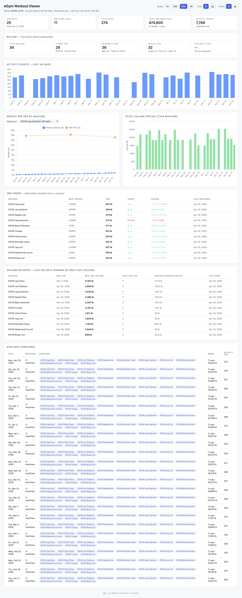

# eGym Personal Viewer

A small, self-contained viewer for **your own** eGym / NetpulseFitness
workout history, strength tests, and bio-age data. One Python script
pulls your data from your gym's mobile-app backend; a single static HTML
page charts it in your browser.

- Zero runtime dependencies beyond Python 3.9+ stdlib
- No database, no build step, no server-side code
- Dark and light themes, `lb` / `kg` toggle, rolling 7d / 30d / 90d / All windows

<picture>
  <source media="(prefers-color-scheme: dark)" srcset="screenshot-dark.png">
  
</picture>

### Try it without an account

Want to poke at the viewer before you have real data?

```bash
python3 generate_demo.py
python3 -m http.server 8765
```

Writes deterministic mock data to `data/workouts.json` for a fictional
"DEMO_GYM" user. Run `python3 fetch.py` to replace with your real data.

## ⚠️ Disclaimer / No Warranty

This project is **not affiliated with, endorsed by, or sponsored by eGym,
Netpulse, or any gym operator.** It uses **undocumented private endpoints**
belonging to the NetpulseFitness mobile app by authenticating with your own
member credentials — the same way the official app does.

Those endpoints can change, be restricted, or be revoked at any time. Your
gym may consider automated access a violation of its terms of service.

**The software is provided "as is", without warranty of any kind,** express
or implied. See [`LICENSE`](LICENSE) for the full MIT disclaimer of warranty
and liability.

**You are solely responsible for:**
- Complying with your gym's terms of service.
- Safeguarding your credentials — the script stores them in a local
  `settings.json` file that is git-ignored by default. **Never commit it.**
- Only using this tool with your own account and your own data.

## Features

- Full workout history (sets, reps, working weight, activity points)
- Latest 1RM readings with ▲/▼ trend and precise % change
- Bio-age snapshot: Total, Cardio (+RHR, VO₂max), Metabolic (+BMI, body fat),
  Muscle (Upper / Core / Lower), Flexibility
- Personal records split into two views:
  - **1RM Trend** — latest strength-test 1RM per machine
  - **Volume Records** — best-day total volume (weight × reps) per machine
- Per-machine chart overlaying working-weight sets and 1RM-test markers
- "Gym Days" table that collapses all machines hit on one day into one row

## Prerequisites

- **Python 3.9 or newer** (stdlib only — no `pip install` required).
- A member account at a gym that runs on the **Netpulse** / **eGym**
  platform. If your gym's app shows `*.netpulse.com` in its address or
  network traffic, you're in the right place.

### Checking your Python version

```bash
python3 --version
```

Should print `Python 3.9.x` or higher. If not:

- **macOS:** `brew install python@3.12`
- **Ubuntu/Debian:** `sudo apt install python3`
- **Windows:** [python.org](https://www.python.org/downloads/)

### (Optional) Using a virtual environment

You don't strictly need one — this project has **zero third-party
dependencies** — but if you prefer to isolate Python runtimes:

```bash
python3 -m venv .venv
source .venv/bin/activate        # macOS / Linux
# or on Windows:  .venv\Scripts\activate

python3 --version                # should now print the venv's Python
```

`.venv/` is git-ignored. When you're done, `deactivate` returns to your
system Python.

## Quickstart

```bash
git clone <your-fork-url> egym-personal-viewer
cd egym-personal-viewer

# 1. Configure credentials
cp settings.json.example settings.json
$EDITOR settings.json     # fill in brand, username, password

# 2. Launch the viewer (auto-fetches if data is stale, then serves on :8765)
python3 serve.py
# open http://localhost:8765/
```

`serve.py` auto-runs `fetch.py` if `data/workouts.json` is missing or
was last synced before today. Useful flags:

```bash
python3 serve.py --force       # always fetch, even if fresh
python3 serve.py --no-fetch    # serve only, skip the staleness check
python3 serve.py --port 9000   # different port
```

You can still run the pieces separately:

```bash
python3 fetch.py               # just refresh the data
python3 -m http.server 8765    # just serve (no fetch)
```

## Configuration

Credentials can come from any of these sources, highest precedence first:

| Source           | Example                                                                                     |
| ---------------- | ------------------------------------------------------------------------------------------- |
| CLI flags        | `python3 fetch.py --brand X --username me@x.com --password 'pw'`                            |
| Environment vars | `EGYM_BRAND=X EGYM_USERNAME=me EGYM_PASSWORD=pw python3 fetch.py`                           |
| `settings.json`  | `{"egym": {"brand": "...", "username": "...", "password": "..."}}`                         |

`settings.json` is git-ignored by default. `settings.json.example` is the
template that *is* committed — never put real credentials into it.

### What's my "brand"?

Your gym's Netpulse subdomain, case-insensitive. It's the **same
brand/club code your gym had you enter when you first signed up for
the eGym member app** (often shown on a welcome flyer or email). For
example, if the app talks to `https://cityfitness.netpulse.com`, your
brand is `CITYFITNESS`. If you don't remember it, check:

- The signup email or welcome flyer from your gym.
- Your gym's front desk — ask for the "eGym club code" or "Netpulse
  brand".
- Network traffic from the mobile app (the `*.netpulse.com` subdomain
  that shows up in requests).

## Project Layout

```
.
├── fetch.py                 # credentials → login → API pulls → ./data/*.json
├── index.html               # vanilla HTML + Chart.js viewer
├── settings.json.example    # template — copy to settings.json (git-ignored)
├── data/                    # generated (git-ignored)
│   ├── workouts.json        # flattened rows + strength + bio-age (consumed by index.html)
│   ├── workouts.csv         # same flattened data as CSV
│   └── workouts_raw.json    # full API payloads (for debugging)
├── CHANGELOG.md
├── LICENSE                  # MIT
└── README.md
```

## Endpoints Used

| Host                                | Path                                                                                                | Purpose                |
| ----------------------------------- | --------------------------------------------------------------------------------------------------- | ---------------------- |
| `{brand}.netpulse.com`              | `POST /np/exerciser/login`                                                                          | member auth            |
| `{brand}.netpulse.com`              | `GET /workouts/api/workouts/v2.3/exercisers/{uid}/workouts?completedAfter=…&completedBefore=…`      | workout history        |
| `mobile-api.int.api.egym.com`       | `GET /measurements/api/v1.0/exercisers/{uid}/strength?startDate=YYYY-MM-DD&endDate=YYYY-MM-DD`      | strength-test history  |
| `mobile-api.int.api.egym.com`       | `GET /analysis/api/v1.0/exercisers/{uid}/bioage`                                                    | bio-age snapshot       |

Auth reuses the `Set-Cookie` returned by login for subsequent requests,
and sends the same `user-agent` / `x-np-user-agent` headers the iOS app
does.

## Known Limitations

- **No way to tell what training plan / phase you're on.** EGYM Genius
  cycles you through different training phases (e.g. Adaptation,
  Hypertrophy, Strength) driven by a proprietary algorithm that reacts
  to your strength-test results and training history — not a fixed
  schedule. That phase dictates your prescribed weights and tempo. All
  endpoints that would reveal the active plan and phase —
  `/trainingplans/*`, `/genius/*`, `/cycle/*` — return **403 Access
  Denied** to member credentials. That data requires a trainer/operator
  role. The viewer shows your prescribed working weights but can't
  label which phase produced them.
- **Workout-type metadata** (Normal / Negative / Basic / Isometric) is
  not exposed by the workout-log API either — each set comes back with
  just reps, weight, calories, and activity points.
- **`weight` in workout logs is your working weight**, *not* your 1RM. The
  1RM comes from the separate strength-test endpoint.
- **Bio-age history** endpoint exists but requires a `granularity` enum
  whose valid values we haven't cracked. Viewer currently shows the latest
  snapshot only.
- **Rate limits.** Repeatedly spamming the login endpoint may get your IP
  temporarily blocked. Re-running `fetch.py` a few times an hour is fine;
  don't put it on a sub-minute cron.

## Troubleshooting

- **"Could not load data/workouts.json"** — you haven't run `fetch.py`
  yet, or the viewer is being served from the wrong directory. Serve from
  the project root (where `index.html` lives), not from inside `data/`.
- **HTTP 400 on workouts** — Netpulse expects RFC3339 dates for
  `completedAfter` / `completedBefore` and raw (un-URL-encoded) `:`
  characters in the query string. `fetch.py` handles this; if you edit
  it, preserve that behavior.
- **HTTP 404 on strength** — the strength endpoint lives on
  `mobile-api.int.api.egym.com`, not the branded netpulse subdomain.
- **Login works once then 401s** — the session cookie may have expired.
  Just re-run `fetch.py`.

## Contributing

PRs welcome. Guiding principles:

- **Zero third-party runtime dependencies.** Keep the bar low for first-time
  clones — Python stdlib + Chart.js from a CDN only.
- **No build step.** `index.html` is served as-is.
- **No telemetry, no analytics, no remote logging.** Everything stays
  local.
- Before opening a PR, run `python3 fetch.py` against your own account
  and make sure the viewer still renders.

See `CHANGELOG.md` for the version history.

## Credits

The API endpoint shapes were discovered by reading the source of
[`soerenuhrbach/egym-exporter`](https://github.com/soerenuhrbach/egym-exporter),
a Prometheus exporter for the same data. Thanks to that project's author
for mapping out the responses.

## License

MIT — see [`LICENSE`](LICENSE).
